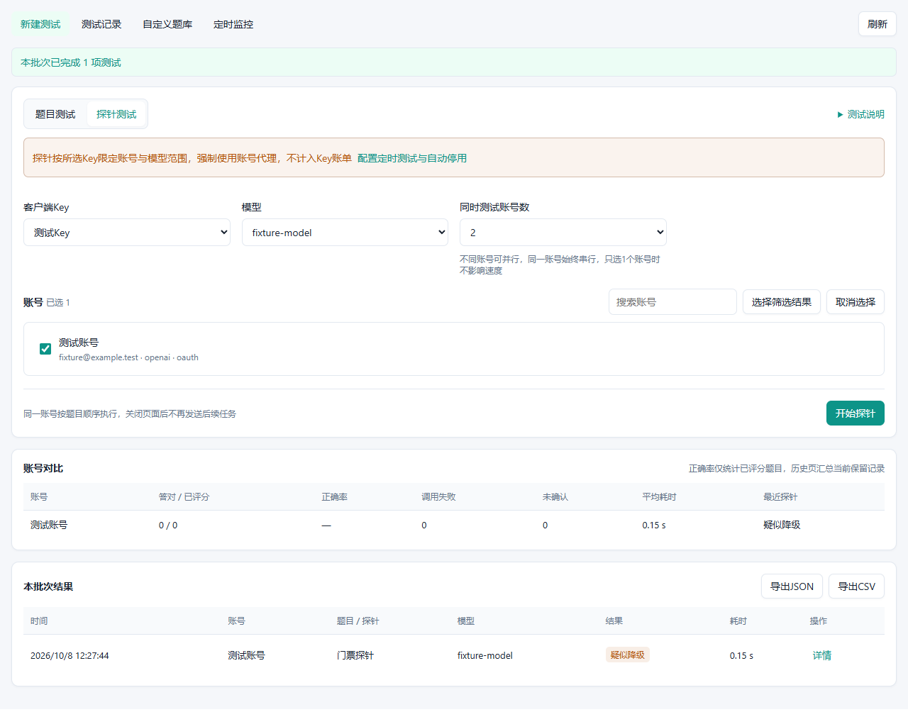

# 模型质量测试

独立 CPR 网关插件 `xunzhimeng.model-quality-test`，用于指定账号的多题推理测试、OpenAI OAuth 两步门票探针、账号对比和结果导出。不修改宿主代码或模型路由；自动停用为可选功能，默认关闭。可与 `codex-iq-watch` 独立安装。

源码仓库：[xunzhimeng/codex-model-quality-test](https://github.com/xunzhimeng/codex-model-quality-test)

## 功能

- 10 道内置客观题，覆盖逻辑、组合、数学、概率、约束规划及代码阅读
- 最多 30 道自定义题，通过管理页 JSON 编辑标准答案，题库容量 240 KB
- 选择账号、客户端 Key、可见模型及思考强度，最多 4 个账号并发，同一账号按题目顺序执行
- 记录原始正式回答、题目快照、标准答案、正确性、总耗时及宿主可提供的用量
- 账号正确率只统计已评分的题目，调用失败和未确认结果单独展示
- 保留最多 100 项历史，入队时按 195 KB 限制移出最早的非在途记录，为在途答案预留空间，可导出 JSON / CSV
- 明暗主题与窄屏布局，页面全部通过公开宿主管理桥通信
- 优先显示账号备注／别称，OAuth 其次显示邮箱，API Key 其次显示账号名称，不使用默认「OpenAI 账号」作为主标识
- 分轮探针详情：HTTP 状态、耗时、完成状态、响应大小、门票长度、路由 Cookie 数量及模型回报
- 后台定时探针、不测试时段（可跨午夜）、每账号每日上限与累计／今日次数，按北京时间计算
- 支持首次疑似降级立即停用或可配置秒数的确认复测策略；确认仍疑似降级可自动停用，支持整组及单账号暂停／继续，默认不开启监控或停用

## 页面预览

以下截图使用真实插件进程和内存宿主回调桩生成，全部为测试数据，不代表真实上游或 Linux Docker 安装验收。




[查看暗色窄屏截图](docs/screenshots/dark-narrow.png)

[分轮探针详情](docs/screenshots/probe-details-v030.png) · [定时监控设置](docs/screenshots/monitor-policy-confirm-v040.png) · [首次降级立即停用](docs/screenshots/monitor-policy-immediate-v040.png) · [执行次数与停用审计](docs/screenshots/monitor-policy-counts-v040.png) · [监控暗色窄屏](docs/screenshots/monitor-policy-dark-narrow-v040.png)（隔离 iframe 内使用固定宿主页组装器、内存回调及本机认证代理／TLS桩验证）

## 使用

目标宿主范围为 **CPR >=3.21.1、<3.22.0**，不再锁定单一补丁版本。已核对官方 3.21.1 与 3.21.2 的插件合同、相关回调及管理接口一致，运行验证使用 3.21.1 的原始校验器与隔离页面。SDK 仍固定引用 `zyycn/codex-proxy-rs@f174320e2ac8987578146d4684e69ad196db0286`，使用清单格式 2 和进程协议 2。未运行验收未来补丁或其他次版本，不宣称支持所有宿主版本。Linux Docker 安装包必须与宿主容器架构匹配，不是浏览器电脑的架构。

在 CPR 插件管理中选择 GitHub 来源 `xunzhimeng/codex-model-quality-test`，选择已发布的对应版本，或上传本地构建的 `.tar.gz`，查看来源后安装并启用，再打开「模型质量测试」。`v0.1.0` 存在清单及协议不兼容，`v0.1.1` 存在管理路由注册错误，`v0.1.2` 的页面使用宿主不支持的模块脚本，CPR 3.21.1 请勿选择这三个包。声明 `management` 和 `maintenance` 能力，不需要请求绑定。新版合同已移除 `permissions` 声明，安装并启用表示完全信任插件代码。插件为 `trustedProcess`，与宿主使用相同系统身份，并非 OS 沙箱。

题目测试需选择启用的客户端 Key。手动测试及定时监控的模型下拉来源为所选 Key 的可见目录，优先保留仍有效的选择，否则默认选择目录中的 `gpt-6-astra`，不存在时选择第一项，空目录不伪造模型。Key 可见并不保证所选 OAuth 账号支持该上游模型。模型调用指定账号也须满足 Key 的账号组、模型权限及宿主资格。账号并发数表示同时测试的不同账号数量，单个账号内始终串行，只选一个账号时不影响速度。题目调用经过 Core 的准入、账号代理、租约、重试与计费链。插件自身不额外重试，每题一次逻辑模型调用不保证上游仅发生一次尝试。

默认全选内置题目，可只选部分题目降低消耗。严格比较标准答案，只忽略首尾空白和包裹整个答案的 Markdown 标记，不从解释里搜索数字。一道题答错不证明账号降级，题库也不是标准化智商测量。

手动批量执行依赖当前页面，关闭页面后不会继续发送后续任务；后台定时探针不依赖页面。「停止后续任务」不撤回已发送的测试。单项最长等待 90 秒，宿主可施加更短期限。先持久化操作 ID 再调用模型，结果丢失或写回失败保留「结果未确认」，应刷新历史，不自动重试。去重仅覆盖当前保留历史，同一 ID 移出后不再有去重保证。题目调用取消、超时或失败后，账号及并发槽保守隔离 150 秒，防止宿主上游清理未完成时重叠执行。插件自有探针的请求结束或取消后直接释放账号及并发槽，无论是否能判定降级，不自动重试，但可手动发起新的探针。宿主重启不会续跑在途测试。

历史和题库使用 `host.state.*`，不存在本地数据库。状态写入使用精确版本，不静默覆盖其他页面保存的题库。原始回答仅保留正式输出，不记录思考过程。请及时导出重要记录，历史容量淘汰不是永久归档。

## 门票探针边界

探针仅适用于 **OpenAI OAuth**。手动与定时探针都必须选择客户端 Key，每次执行重新核对 Key 启用状态、Key 可见模型、启用账号组归属和账号模型政策。Key 仅用于范围校验，**不代表经过 Key 计费、额度或账号租约链**；账号模型映射不会自动应用，输入名称须是实际上游模型且在所选 Key 的可见目录内。

出站必须使用账号管理中配置的完整代理，支持 HTTP、HTTPS、SOCKS5、SOCKS5H 代理（包括认证）。账号未配置代理、导出缺少代理、代理无法连接或失败均停止探测，不回退直连，也不使用环境代理。两轮向固定的 `https://chatgpt.com/backend-api/codex/responses` 端点发送极短请求：

1. 首轮不带门票及 Cookie，读取 `x-codex-turn-state` 和 `__cflb` / `__oailb` 路由 Cookie
2. 同一账号携带首轮门票及路由 Cookie 再发一轮
3. 两轮均 HTTP 200、完整读取到成功完成事件后，第二轮返回不同门票记为「疑似降级」，没返回门票或返回原票记为「未发现降级」

缺少首轮门票、认证失败、限流、流不完整或网络错误均显示「无法判断」。不依据响应 `model` 字段判定。该判据参考 [sub2api 固定提交实现](https://github.com/ranxi2001/sub2api/blob/1c28a9f5a1e9fbc00eb4f25c7f0e77a81c8e45fd/backend/internal/service/openai_codex_state_probe.go#L93-L198)，不是 OpenAI 官方质量保证，应结合重复测试趋势与题目结果。

CPR 3.21.1 普通 `host.http.*` 没有指定账号代理合同，安全账号列表又只提供脱敏端点。因此插件通过受管内部 `host.http.dispatch` 调用 `GET /api/admin/accounts/export?accountIds=<当前单账号ID>&confirm=export_sensitive_accounts`，只请求当前一个账号。导出同时包含敏感令牌：插件在内存校验 Provider、内外部账号ID及数量，提取访问令牌和完整代理URL，其余字段直接丢弃。不缓存、存盘或返回导出文档，不把代理认证放入状态、界面或日志。

上游出站由插件自己的 reqwest 客户端负责，固定目标、正常 TLS 证书验证、禁用重定向与自动重试；**不经过宿主受管网络发送器或其网络策略、原生 TLS 画像、账号代理租约**，父调用取消时直接丢弃本轮网络 future。仍受插件自己及宿主父调用期限限制。不自动刷新令牌，过期时先在宿主刷新。请求身份通过公开服务 `settings.preview_client_profile("openai", None)` 读取宿主当前全局OpenAI画像的 `originator`、`codexVersion` 与完整 `userAgent`，不硬编码版本或附加插件后缀，不继承Key级画像覆盖。两轮使用同一份身份快照，每次新探针重新读取；画像无法读取或请求头无效时停止，不回退到自造身份。HTTP会话头使用 `session-id`，每轮携带新的 `x-client-request-id` 和 `x-codex-routing-hint: model=<所选模型>`，不发送WS专属或旧实验 `openai-beta` 头。身份与会话头仅用于本次调用，不写历史或返回页面；请求正文与门票判据保持不变，真实上游兼容性仍需在目标环境验证。

令牌、门票及 Cookie 只用于本次调用内存，不返回页面、不存历史、不写日志。插件不保存或刷新账号凭据；仅在明确启用自动停用且满足规则时修改账号启用状态，不修改模型路由。

## 定时监控与自动停用

管理页「定时监控」设置「启用定时探针」和「启用自动停用账号」，默认均关闭，自动停用依赖后台监控。选择客户端Key、1至50个已配置代理的OpenAI OAuth账号、实际上游模型和常规间隔（5至1440分钟，默认30分钟）。保存后首轮在该间隔之后执行。

- 不测试时段默认关闭，可配置每天一段 `HH:MM`，支持跨午夜，开始包含、结束不包含，二者不能相同。按**北京时间（UTC+8）**计算，不受浏览器或容器时区影响。
- 每个账号独立每日上限（1至1440次，默认48次），北京时间零点重置。一次后台探针任务计1次，其两轮HTTP请求不拆分计数；确认复测另计1次。已准入但超时、失败、取消或状态写回不明仍计次，准入前被限制或账号资格拒绝不计。计数是监控尝试次数，不是成功数或HTTP请求数。
- 降级处理策略默认为「延迟复测」，等待秒数可设置1至86400，默认60秒。后台首次明确 `degraded` 后，从完成时间开始等待设定秒数，再由维护回调确认一次。只有复测仍明确 `degraded`，且同一设置代次、账号、Key、模型并启用自动停用，才停用。
- 可选「首次疑似降级立即停用，不复测」：第一次明确 `degraded` 完成后，在同一维护调用中发起停用，不预约第二次探针。仍必须启用自动停用；该策略误停风险更高，不会根据模型名或HTTP失败直接停用。
- 两种策略下，HTTP失败、超时、认证失败、无法判断或恢复正常都不触发停用；延迟策略的失败复测清空确认链，不继续重复复测。未开启自动停用时不会停用账号，延迟策略仍可用于确认记录。
- 时间窗口、每日上限、暂停优先于确认复测。等待期间不再启动同账号常规测试，即使配置秒数长于常规间隔；复测被限制则取消该确认链。等待跨过禁测时段不预约确认，维护中断跨过禁测时段或确认到期后超过一个常规间隔则作废，不用陈旧结果自动停用。
- **手动探针不遵守后台时间／次数限制，不计入监控次数、不触发确认或自动停用**；题目测试同样不参与监控。
- 整组和每账号分别暂停／继续，整组暂停优先。暂停清空确认链，不撤回在途请求；继续后按常规间隔重新排期，保留累计／当日次数和停用审计，不启用已停用账号。保存设置也清空确认链、重排到期，但不清次数或暂停状态；移除再加入账号不能重置当日额度。
- 使用宿主约30秒一次的 `plugin.reconcile` 维护回调，每次最多处理一个到期账号，不启动脱离父调用的请求或sleep等待。后台探针最多等待18秒，确认实际执行取决于维护回调及其他到期账号，不保证精确到秒。
- 关闭页面后仍运行，停用插件后停止。预约先落盘防重复，取消或重启遗留的在途预约保守隔离150秒后清空确认，不补发全部错过周期。
- 自动停用使用宿主 `POST /api/admin/accounts/batch-update`，只更新所选内部账号ID的 `enabled:false`。停用前记录意图，回读确认状态；响应或写回不明时保留待确认审计，不自动重发。账号不会自动启用，请在账号管理人工核对／恢复。
- 设置、预约、暂停、计数及停用审计使用独立 `monitor` 私有记录，历史和题库不变。累计／当日次数自本版开始统计，不从有限历史推测旧次数；汇总包括曾被监控的账号，逐行展示当前计划。
- **升级至v0.4.0时旧计划首次读取或维护会关闭定时与自动停用、清空旧确认链**，保留历史、题库和停用审计。请核对每日上限、不测试时段、Key与账号代理后重新保存启用，避免旧规则自动产生新复测请求。

探针判据是经验信号，自动停用可能误判，启用前请评估可用账号数量与业务影响。

## 自定义题库

管理页「自定义题库」保存 JSON 数组，内置题不可覆盖，ID 使用 `custom_` 开头的字母、数字、下划线。标准答案使用单个明确文本，不支持模型裁判或执行答案代码。

```json
[{"id":"custom_sum","title":"加法","category":"数学","prompt":"17加28等于多少？只输出整数","answer":"45"}]
```

内置糖果题显式说明可按形状选择数量，最优策略共 21 颗，避免将不可控随机混抽误认为同一题目。

## 构建与验证

需要 Rust 1.97.0、Node.js 24 和 pnpm 11。先检出独立仓库，再从仓库根目录执行：

```bash
git clone https://github.com/xunzhimeng/codex-model-quality-test.git
cd codex-model-quality-test
```

```bash
cargo +1.97.0 fmt -- --check
cargo +1.97.0 clippy --all-targets --locked -- -D warnings
cargo +1.97.0 test --locked
cargo +1.97.0 build --locked
python -m pip install -r tests/requirements.txt
python tests/protocol_test.py
pnpm --dir frontend install --frozen-lockfile
pnpm --dir frontend build
pnpm --dir frontend test
cargo +1.97.0 build --release --locked --target x86_64-unknown-linux-gnu
cpr-plugin package --manifest plugin.json --binary target/x86_64-unknown-linux-gnu/release/model-quality-test --target x86_64-unknown-linux-gnu --resource-map web=web --output-dir dist
```

Rust 使用公开 SDK，不依赖宿主内部模块。协议集成测试启动真实插件进程，宿主回调为内存桩，网络为本机认证 CONNECT 代理与临时 CA 签发的 TLS 上游桩，不解析或连接真实 ChatGPT，不使用真实令牌。测试 CA 通过子进程的 `SSL_CERT_FILE` 传入，不安装到系统信任库。Windows 和 Linux 本机构建产物均可测试。前端为 Vue SFC + TypeScript，通过 Vite 库模式生成包含 Vue 的单个 IIFE 经典脚本，HTML 使用 `frontend/public/index.html`，不引用模块或外部依赖。开发入口的 ES Module 只用于本地开发，不能作为宿主页交付，生产构建后再运行前端测试检查实际产物。

打包工具必须与目标宿主合同一致，使用 `v3.21.1` 源码构建的 `cpr-plugin`，不要复用旧版协议 1 的打包工具。CLI 仅校验和生成安装包，不编译插件。ARM64 环境需改用 `aarch64-unknown-linux-gnu`，不能只更改包的平台声明。
