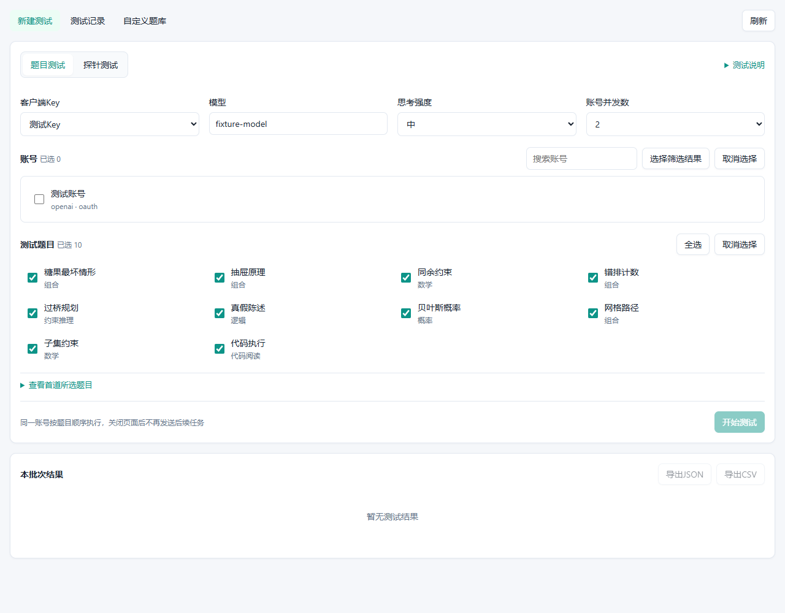
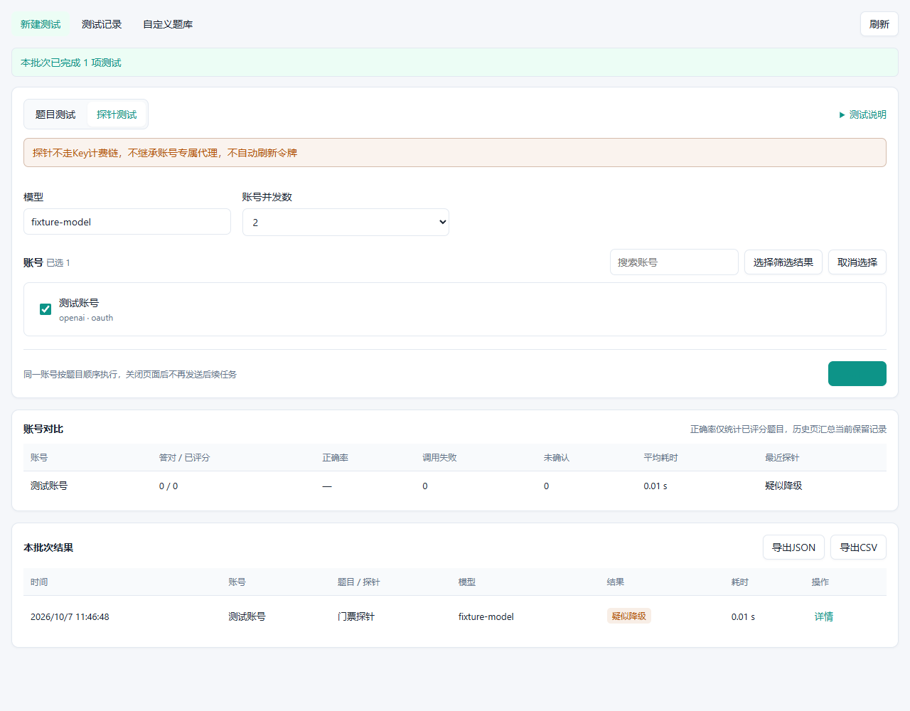

# 模型质量测试

独立 CPR 网关插件 `xunzhimeng.model-quality-test`，用于指定账号的多题推理测试、OpenAI OAuth 两步门票探针、账号对比和结果导出。不修改宿主代码或账号调度，可与 `codex-iq-watch` 独立安装。

源码仓库：[xunzhimeng/codex-model-quality-test](https://github.com/xunzhimeng/codex-model-quality-test)

## 功能

- 10 道内置客观题，覆盖逻辑、组合、数学、概率、约束规划及代码阅读
- 最多 30 道自定义题，通过管理页 JSON 编辑标准答案，题库容量 240 KB
- 选择账号、客户端 Key、可见模型及思考强度，最多 4 个账号并发，同一账号按题目顺序执行
- 记录原始正式回答、题目快照、标准答案、正确性、总耗时及宿主可提供的用量
- 账号正确率只统计已评分的题目，调用失败和未确认结果单独展示
- 保留最多 100 项历史，入队时按 195 KB 限制移出最早的非在途记录，为在途答案预留空间，可导出 JSON / CSV
- 明暗主题与窄屏布局，页面全部通过公开宿主管理桥通信

## 页面预览

以下截图使用真实插件进程和内存宿主回调桩生成，全部为测试数据，不代表真实上游或 Linux Docker 安装验收。





[查看暗色窄屏截图](docs/screenshots/dark-narrow.png)

## 使用

目标宿主为 **CPR 3.21.1**，SDK 固定引用该正式版提交 `zyycn/codex-proxy-rs@f174320e2ac8987578146d4684e69ad196db0286`，使用清单格式 2 和进程协议 2。不宣称兼容未经验证的宿主版本。Linux Docker 安装包必须与宿主容器架构匹配，不是浏览器电脑的架构。

在 CPR 插件管理中选择 GitHub 来源 `xunzhimeng/codex-model-quality-test`，指定标签 `v0.1.1`，或上传相应 `.tar.gz`，查看来源后安装并启用，再打开「模型质量测试」。旧版 `v0.1.0` 使用清单格式及协议 1，无法在 CPR 3.21.1 安装，请勿选择该包。仅声明 `management` 能力，不需要请求绑定。新版合同已移除 `permissions` 声明，安装并启用表示完全信任插件代码。插件为 `trustedProcess`，与宿主使用相同系统身份，并非 OS 沙箱。

题目测试需选择启用的客户端 Key。模型下拉来源为该 Key 的可见目录，指定账号也须满足 Key 的账号组、模型权限及宿主资格。题目调用经过 Core 的准入、账号代理、租约、重试与计费链。插件自身不额外重试，每题一次逻辑模型调用不保证上游仅发生一次尝试。

默认全选内置题目，可只选部分题目降低消耗。严格比较标准答案，只忽略首尾空白和包裹整个答案的 Markdown 标记，不从解释里搜索数字。一道题答错不证明账号降级，题库也不是标准化智商测量。

批量执行依赖当前页面，关闭页面后不会继续发送后续任务。「停止后续任务」不撤回已发送的测试。单项最长等待 90 秒，宿主可施加更短期限。先持久化操作 ID 再调用模型，结果丢失或写回失败保留「结果未确认」，应刷新历史，不自动重试。去重仅覆盖当前保留历史，同一 ID 移出后不再有去重保证。取消、超时或调用失败后账号及并发槽保守隔离 150 秒，防止上游清理未完成时重叠执行。宿主重启不会续跑在途测试。

历史和题库使用 `host.state.*`，不存在本地数据库。状态写入使用精确版本，不静默覆盖其他页面保存的题库。原始回答仅保留正式输出，不记录思考过程。请及时导出重要记录，历史容量淘汰不是永久归档。

## 门票探针边界

探针仅适用于 **OpenAI OAuth**，通过 `host.auth.get` 在后端取得当前访问令牌，通过宿主 `host.http.do_stream` 向固定的 ChatGPT Codex Responses 端点发送两条极短请求：

1. 首轮不带门票及 Cookie，读取 `x-codex-turn-state` 和 `__cflb` / `__oailb` 路由 Cookie
2. 同一账号携带首轮门票及路由 Cookie 再发一轮
3. 两轮均 HTTP 200、完整读取到成功完成事件后，第二轮返回不同门票记为「疑似降级」，没返回门票或返回原票记为「未发现降级」

缺少首轮门票、认证失败、限流、流不完整或网络错误均显示「无法判断」。不依据响应 `model` 字段判定。该判据参考 [sub2api 固定提交实现](https://github.com/ranxi2001/sub2api/blob/1c28a9f5a1e9fbc00eb4f25c7f0e77a81c8e45fd/backend/internal/service/openai_codex_state_probe.go#L93-L198)，不是 OpenAI 官方质量保证，应结合重复测试趋势与题目结果。

按本插件实现边界，探针**不经过 Key 计费、账号模型映射、账号租约或账号专属代理，不自动刷新令牌**，因此模型输入使用上游实际名称，宿主须具备到 ChatGPT 的网络连通性。OAuth 令牌过期时先在宿主刷新。出站网络仍受宿主安全策略及期限约束。请求身份采用当前固定宿主提交中的离线 CLI 版本 `0.155.0`，不跟踪官方版本更新，无法取得宿主动态客户端画像或 TLS 画像，真实上游兼容性需在目标环境验证。

令牌、门票及 Cookie 只用于本次调用内存，不返回页面、不存历史、不写日志。插件不保存或刷新账号凭据，不会隔离账号或修改模型路由。

## 自定义题库

管理页「自定义题库」保存 JSON 数组，内置题不可覆盖，ID 使用 `custom_` 开头的字母、数字、下划线。标准答案使用单个明确文本，不支持模型裁判或执行答案代码。

```json
[{"id":"custom_sum","title":"加法","category":"数学","prompt":"17加28等于多少？只输出整数","answer":"45"}]
```

内置糖果题显式说明可按形状选择数量，最优策略共 21 颗，避免将不可控随机混抽误认为同一题目。

## 构建与验证

需要 Rust 1.97.0、Node.js 24 和 pnpm 11。先检出独立仓库，再从仓库根目录执行：

```bash
git clone https://github.com/xunzhimeng/codex-model-quality-test.git
cd codex-model-quality-test
```

```bash
cargo +1.97.0 fmt -- --check
cargo +1.97.0 clippy --all-targets --locked -- -D warnings
cargo +1.97.0 test --locked
cargo +1.97.0 build --locked
python tests/protocol_test.py
pnpm --dir frontend install --frozen-lockfile
pnpm --dir frontend build
pnpm --dir frontend test
cargo +1.97.0 build --release --locked --target x86_64-unknown-linux-gnu
cpr-plugin package --manifest plugin.json --binary target/x86_64-unknown-linux-gnu/release/model-quality-test --target x86_64-unknown-linux-gnu --resource-map web=web --output-dir dist
```

Rust 使用公开 SDK，不依赖宿主内部模块。协议集成测试启动真实插件进程，宿主回调全部为内存桩，不使用真实令牌或发送上游请求；Windows 和 Linux 本机构建产物均可测试。前端为 Vue SFC + TypeScript，通过 Vite 生成随包资源，不借用宿主 Vue 实例。

打包工具必须与目标宿主合同一致，使用 `v3.21.1` 源码构建的 `cpr-plugin`，不要复用旧版协议 1 的打包工具。CLI 仅校验和生成安装包，不编译插件。ARM64 环境需改用 `aarch64-unknown-linux-gnu`，不能只更改包的平台声明。
